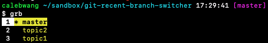

Basic Usage:

`grb [N]` — list N most recent branches (default: 20)

`j` — navigate down in list of branches

`k` — navigate up in list of branches

`[0-9]+` — jump to line number; resets on overflow

`G` — jump to bottom of list

`gg` — jump to top of list

`Enter` — select branch to switch to
